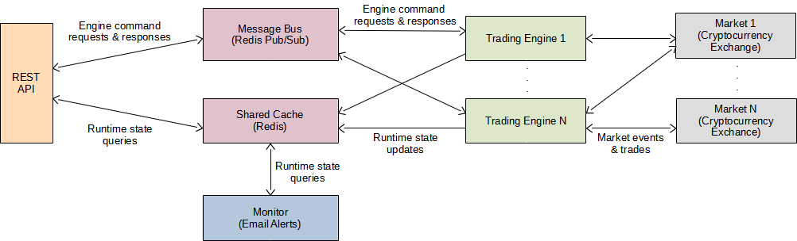
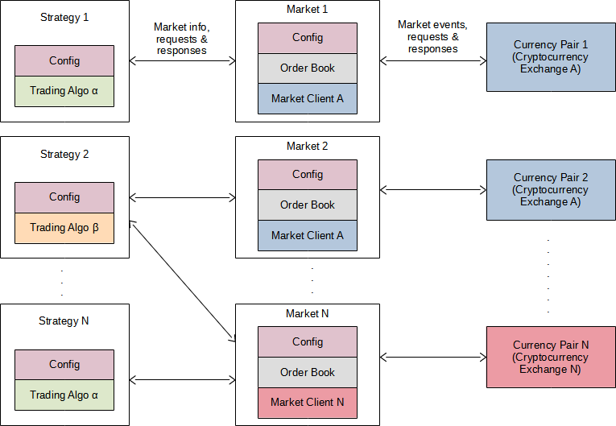

# Moonship

Moonship is a high-frequency cryptocurrency trading application that provides the
core application framework and market interfaces.

Trading algorithms and strategies are implemented as plugins and are proprietary.

Fly me **To The Moon!**

## Features
- Supports multiple trading algorithms and market interfaces via a pluggable
  architecture.
- Runs multiple trading strategies concurrently across multiple markets.
- Makes trading decisions based on live market data.
- Provides a REST API service to monitor trading activity and control application behaviour of
  one or more moonship instances.
- Provides a monitor service supporting email alerts based on configurable trigger conditions.
- Supported cryptocurrency exchanges:
  - Binance
  - Luno
  - VALR

## Architecture

### Overview

Moonship uses a microservices architecture and has been designed to run primarily in a cloud
environment where it responds 24/7 to live market events. The diagram below depicts the
architecture of a typical deployment.

- The **Trading Engine** receives live market data and performs trades based on the configured trading strategies.
  Multiple Trading Engines can be run simultaneously to balance load across multiple services, or to separate
  trading strategies into logical units or groups. The Trading Engine can also be run as a standalone application in
  a non-cloud environment.
- A **Shared Cache** stores runtime state information sent by the Trading Engine. For example, the trading strategies'
  statuses, current profit/loss, etc.
- The [REST API](https://mpaulse.com/moonship/doc/api.html) is used to send control commands to the Trading Engines via the **Message Bus** and to query the
  state information in the Shared Cache.
- The **Monitor** watches the Shared Cache and sends alerts (emails) when various configurable conditions are
  triggered. For example, when a trading strategy has reached its stop-loss and has become inactive.

### The Trading Engine

The following diagram illustrates the components within the Trading Engine:

- The **Market** represents the market for a particular currency pair at a particular cryptocurrency exchange. It 
  provides various market information such as the current order book, the most recent trades list, the current price, etc.
  It also acts as the interface through which requests to the exchange are made by the rest of the application.
- The **Market Client** forms part of the Market and implements the network protocol for communicating with the
  exchange.
- The **Strategy** encapsulates a particular **Trading Algorithm** implementation as well as the configuration that 
  defines that algorithm's behaviour. Each Strategy is associated with one or more Markets. A single Strategy may
  therefore operate across multiple markets, and thus, across multiple cryptocurrency exchanges depending on the
  algorithm.

The Trading Engine is an event-based application. Live market data received by the Market Client (e.g. via websocket)
propagate to the rest of the application (e.g. to the Strategies) via event handlers.

## Usage

- To run **only** the Trading Engine service:

  > moonship -c *CONFIG_FILE*

  or

  > python -m moonship -c *CONFIG_FILE*

- To run **only** the API service:

  > moonship -a -c *CONFIG_FILE*

  or

  > python -m moonship -a -c *CONFIG_FILE*

- To run **only** the monitor service:

  > moonship -m -c *CONFIG_FILE*

  or

  > python -m moonship -m -c *CONFIG_FILE*

- To run **multiple** the services in a single process (e.g. the API service and monitor):

  > moonship -a -m -c *CONFIG_FILE*

  or

  > python -m moonship -a -m -c *CONFIG_FILE*

## API Usage

See the [API documentation](https://mpaulse.com/moonship/doc/api.html).

## Configuration

Application configuration is specified within a YAML file. See the [sample configuration](config-example.yml) file
for an example.

The tables below describe the various configuration properties.

### Trading Engine Properties

| Property                                                  | Description                                                                                                                                                                                                                                                                                                                         |
|-----------------------------------------------------------|-------------------------------------------------------------------------------------------------------------------------------------------------------------------------------------------------------------------------------------------------------------------------------------------------------------------------------------|
| moonship.engine.name                                      | The name of the Trading Engine instance. Used to identify the instance in a multi-instance deployment.   Defaults to "engine".                                                                                                                                                                                              |
| moonship.markets.*MARKET_NAME*.account                    | The ID or name of the account to use at the cryptocurrency exchange by default when placing orders in the *MARKET_NAME* market. This parameter is optional and can be overridden on a per-order basis.                                                                                                                      |
| moonship.markets.*MARKET_NAME*.client                     | The name of the Market Client implementation class that is used to communicate with the cryptocurrency exchange for the *MARKET_NAME* market.   Supported values:<ul><li>moonship.client.binance.BinanceClient</li><li>moonship.client.luno.LunoClient</li><li>moonship.client.valr.ValrClient</li></ul>                    |
| moonship.markets.*MARKET_NAME*.enable_margin              | Specifies whether margin trading should be enabled by default when placing orders in the *MARKET_NAME* market. Can be overridden on a per-order basis.   Defaults to false.    **Note:** Before setting this parameter to true, the account at the cryptocurrency exchange must also be enabled for margin trading. |
| moonship.markets.*MARKET_NAME*.max_recent_trade_list_size | The maximum number of the most recent trades to maintain in memory for the *MARKET_NAME* market.  Defaults to 10000.                                                                                                                                                                                                        |
| moonship.markets.*MARKET_NAME*.symbol                     | The currency pair ticker symbol for the *MARKET_NAME* market. This must be a valid symbol listed at the cryptocurrency exchange. For example, "BTCUSDT".                                                                                                                                                                            |
| moonship.strategies.*STRATEGY_NAME*.algo                  | The name of the Trading Algorithm implementation class for the *STRATEGY_NAME* strategy.                                                                                                                                                                                                                                            |
| moonship.strategies.*STRATEGY_NAME*.auto_start            | Indicates whether the *STRATEGY_NAME* strategy should automatically be run at start-up.  Supported values:<ul><li>true</li><li>false</li></ul>Defaults to false.                                                                                                                                                            |
| moonship.strategies.*STRATEGY_NAME*.*ADDITIONAL_PROPERTY* | Any additional property supported by the Trading Algorithm implementation class that should be set for the *STRATEGY_NAME* strategy.                                                                                                                                                                                                |

### Market Client Properties

| Property                    | Description             |
|-----------------------------|-------------------------|
| moonship.binance.api_key    | The Binance API key.    |
| moonship.binance.api_secret | The Binance API secret. |
| moonship.luno.api_key       | The Luno API key.       |
| moonship.luno.api_secret    | The Luno API secret.    |
| moonship.valr.api_key       | The VALR API key.       |
| moonship.valr.api_secret | The VALR API secret.    |

### API Service Properties

| Property                          | Description                                                                                                                                                                                                                                                                                                                                                                                                                             |
|-----------------------------------|-----------------------------------------------------------------------------------------------------------------------------------------------------------------------------------------------------------------------------------------------------------------------------------------------------------------------------------------------------------------------------------------------------------------------------------------|
| moonship.api.access_log_format    | The [format](https://docs.aiohttp.org/en/stable/logging.html#format-specification) of the API access log messages.  Defaults to ``%a %t "%r" %s %b "%{Referer}i" "%{User-Agent}i``.                                                                                                                                                                                                                                             |
| moonship.api.idle_session_expiry  | The amount of time in minutes before an idle user session expires. A value of 0 indicates no expiry time.  Defaults to 0.                                                                                                                                                                                                                                                                                                       |  
| moonship.api.password             | The password used to log into the API. Must be specified as a bcrypt hash string.                                                                                                                                                                                                                                                                                                                                                       |
| moonship.api.port                 | The port number on which the API service listens for HTTP requests.   Defaults to 8080.  Some cloud hosting providers provide the port number via a dynamically set environment variable. To specify the name of the environment variable to read the port from, set the property value to $*ENV_VAR_NAME*. For example, if the port number is provided using the PORT environment variable, set the property to $PORT. |
| moonship.api.user                 | The username used to log into the API.                                                                                                                                                                                                                                                                                                                                                                                                  |
| moonship.api.ssl_cert             | The file (in PEM format) containing the API SSL certificate.                                                                                                                                                                                                                                                                                                                                                                            |
| moonship.api.ssl_key              | The file containing the API SSL certificate private key.                                                                                                                                                                                                                                                                                                                                                                                |

### Monitor Properties

| Property                                      | Description                                                                                                                                                                                                                                                                                                                                                                                                                                                                                                                                                                           |
|-----------------------------------------------|---------------------------------------------------------------------------------------------------------------------------------------------------------------------------------------------------------------------------------------------------------------------------------------------------------------------------------------------------------------------------------------------------------------------------------------------------------------------------------------------------------------------------------------------------------------------------------------|
| moonship.monitor.poll_interval                | The amount of time in seconds to wait before polling the shared cache for information updates.   Defaults to 5.                                                                                                                                                                                                                                                                                                                                                                                                                                                               |
| moonship.monitor.alerts.*ALERT_NAME*.condition | The trigger condition for the *ALERT_NAME* alert expressed using the [Rule Engine syntax](https://zerosteiner.github.io/rule-engine/syntax.html). It operates on the runtime strategy information stored in the shared cache (the strategy objects returned by the [GET /strategies](https://mpaulse.com/moonship/doc/api.html#tag/Strategies/paths/~1strategies/get)  API call).  **Example**:  The following condition matches all strategies that have become inactive for whatever reason (e.g. after hitting a stop-loss): ``not active and start_time != null`` |  
| moonship.monitor.alerts.*ALERT_NAME*.actions  | The action or list of actions to execute when the *ALERT_NAME* alert triggers.   Defaults to an empty list. If no actions are specified, a warning is logged at start-up and only an informational message is logged when the alert triggers.   Supported actions: <ul><li>email</li></ul>                                                                                                                                                                                                                                                                            |
| moonship.monitor.email.from                   | The sender email address to use when sending alert emails.                                                                                                                                                                                                                                                                                                                                                                                                                                                                                                                            |
| moonship.monitor.email.password               | The password to use to log into the SMTP server.                                                                                                                                                                                                                                                                                                                                                                                                                                                                                                                                      |
| moonship.monitor.email.smtp_host              | The SMTP server hostname or IP address to connect to when sending alert emails.                                                                                                                                                                                                                                                                                                                                                                                                                                                                                                       |
| moonship.monitor.email.smtp_port              | The SMTP server port to connect to when sending alert emails.  Defaults to 587.                                                                                                                                                                                                                                                                                                                                                                                                                                                                                               |
| moonship.monitor.email.to                     | The receipient email address or list of receipient email addresses to use when sending alert emails.                                                                                                                                                                                                                                                                                                                                                                                                                                                                                  |
| moonship.monitor.email.username               | The username to use to log into the SMTP server.                                                                                                                                                                                                                                                                                                                                                                                                                                                                                                                                      |

### Redis Properties

| Property                       | Description                                                                                                                                                                                                                                                                                                                                                    |
|--------------------------------|----------------------------------------------------------------------------------------------------------------------------------------------------------------------------------------------------------------------------------------------------------------------------------------------------------------------------------------------------------------|
| moonship.redis.ssl_verify_cert | Indicates whether the Redis server's SSL certificate should be verified.  Supported values:<ul><li>true</li><li>false</li></ul>Defaults to true.                                                                                                                                                                                                       |
| moonship.redis.url    | The Redis server URL.  Some cloud hosting providers provide the URL via a dynamically set environment variable. To specify the name of the environment variable to read the URL from, set the property value to $ENV_VAR_NAME. For example, if the URL is provided using the REDISCLOUD_URL environment variable, set the property to $REDISCLOUD_URL. |

### Logging Properties

| Property                                           | Description                                                                                                                                                                                                                                                                                                                  |
|----------------------------------------------------|------------------------------------------------------------------------------------------------------------------------------------------------------------------------------------------------------------------------------------------------------------------------------------------------------------------------------|
| moonship.logging.loggers.*LOGGER_NAME*.level       | The log level associated with the *LOGGER_NAME* logger. The *LOGGER_NAME* may be a name such as "moonship.market", etc.  Log level values (from highest to lowest): <ul><li>CRITICAL</li><li>ERROR</li><li>WARNING</li><li>INFO</li><li>DEBUG</li></ul>By default the "moonship" logger is set the "INFO" log level. |
| moonship.logging.root.handlers                     | The list of logger handler names. Each handler is configured using the *HANDLER_NAME* properties below.  Defaults to a single "stdout" handler.                                                                                                                                                                      |
| moonship.logging.handlers.*HANDLER_NAME*.class     | The name of the [class](https://docs.python.org/3/library/logging.handlers.html#module-logging.handlers) implementing the *HANDLER_NAME* handler.                                                                                                                                                                            |
| moonship.logging.handlers.*HANDLER_NAME*.formatter | The name of the formatter that the handler uses to format log messages. The formatter is configured using the *FORMAT_NAME* property below.                                                                                                                                                                                  |
| moonship.logging.handlers.*HANDLER_NAME*.*ADDITONAL_PROPERTY* | Any additional property supported by the handler [class](https://docs.python.org/3/library/logging.handlers.html#module-logging.handlers). For example, the "stream" property can be specified for the StreamHandler, while the "filename" property can be specified for the RotatingFileHandler.                            |
| moonship.logging.formatters.*FORMAT_NAME*.format   | The [format](https://docs.python.org/3/library/logging.html#formatter-objects) of the log messages produced by the *FORMAT_NAME* formatter.  By default, the following format is used for the "log" formatter: ``[%(asctime)s] %(levelname)s - %(name)s: %(message)s``                                               | 
